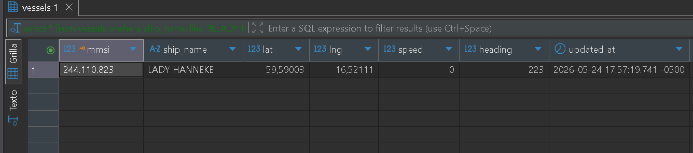

# Marine Traffic

Realtime maritime tracking project built with Rust.

Currently focused on:

- ingesting AIS vessel data
- learning async Rust
- realtime event processing
- geospatial systems

## Workspace

```txt
apps/
├── ingest-service/
├── api/
└── packages/database
```

## Ingest Service

For running the ingest-service just use:

```shell
cargo run -p ingest-service
```

## Database

Also now to allow the income data to allow the future api, we'll need a database so run:

```shell
docker compose up -d
```

then ``diesel setup`` from ``packages/database``

Lastly to generate the ``schema.rs`` just use:

```shell
diesel migration run
```

once you generated the schema and created the table if you want a taste of how the data is going to be generated and allocated, you can uncomment the code at ``ingest-service``

```rust
  if let Some (message) = read.next().await {
    let message = message.expect("Failed to read message");
    println!("Creating the vessel for message: {}", message);
    let message: RootMessage = serde_json::from_str(&message.to_string()).expect("Failed to parse message");
    let vessel = create_vessel(connection, &Vessel {
      mmsi: message.metadata.mmsi,
      ship_name: message.metadata.ship_name,
      lat: message.metadata.lat,
      lng: message.metadata.lng,
      speed: message.message.position_report.speed,
      heading: message.message.position_report.heading,
      updated_at: chrono::Utc::now(),
    });
    println!("Vessel created: {:?}", vessel);
  };
```

Congrats! you've got your first vessel.



if you want to try to show them into the console you can try the following command.

```shell
cargo run -p database --bin show_vessels
```
